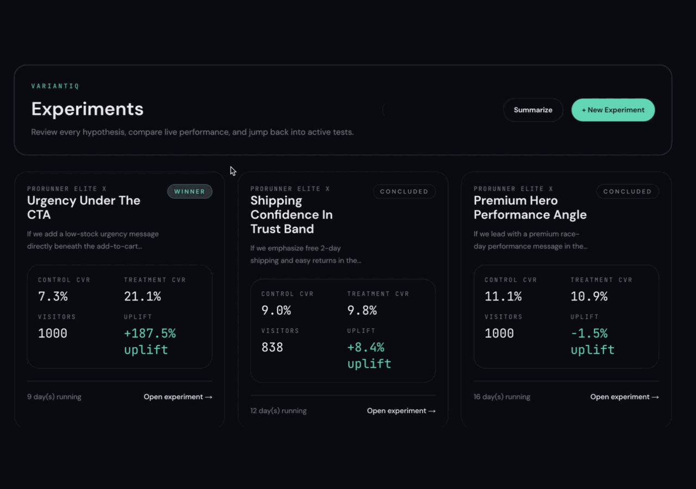

# VariantIQ

VariantIQ is an AI-powered A/B testing app for eCommerce teams. A merchant writes a hypothesis in plain English, VariantIQ generates experiment variants with Codex, previews them against a real product page, launches the test, and tracks visits, conversions, uplift, and confidence in a merchant dashboard.

The storefront model is product-driven rather than hardcoded to one demo page. Each product carries structured storefront content for its gallery, purchase options, trust copy, reviews, and recommendations, and both the live UI and the Codex prompt contract derive from that same data.

Inspired by the idea that experimentation should be an operating loop rather than a slow manual workflow, VariantIQ uses Codex as a runtime collaborator instead of a one-off content generator.

Current use cases are structured eCommerce product pages, especially for testing hero messaging, purchase modules, trust content, social proof, recommendations, and above-the-fold layout changes.

The extension path is an increasingly autonomous optimization system: Codex can eventually research prior wins and losses, propose new tests, generate variants, launch within safety rules, and promote or pause changes based on the metric being optimized.

## Product tour



The app has two user-facing surfaces:

- Internal app: authenticated merchant dashboard for creating, launching, and reviewing experiments
- Public storefront: canonical product pages that serve live experiment variants to anonymous shoppers

## Stack

- Next.js 14 App Router
- Supabase for Postgres, Auth, and RLS
- `@openai/codex-sdk` for server-side variant generation and experiment summaries
- Tailwind CSS for UI styling
- Railway for hosting the full Next.js app
- Vitest and Playwright for validation

## Architecture

VariantIQ does not use a separate backend service. Next.js route handlers are the backend, and all Codex calls stay server-side.

- `app/(internal)`: merchant dashboard routes
- `app/(store)/products/[slug]`: canonical storefront route
- `app/api/generate`: Codex-backed experiment generation
- `app/api/experiments/summary`: Codex-backed experiment analysis
- `lib/codex.ts`: prompt, parsing, and validation logic for Codex interactions
- `lib/experiments.ts`: experiment CRUD, preview helpers, live experiment lookup
- `lib/tracking.ts`: visit/conversion logging and dashboard stats
- `lib/db/schema.sql`: database schema and starter product seeds
- `lib/db/demo_seed.sql`: reusable SQL function for seeding demo experiments for a merchant account

Important runtime rules:

- Codex is never called from client components.
- `OPENAI_API_KEY` and `SUPABASE_SERVICE_ROLE_KEY` stay server-side only.
- Experiment variants are rendered in sandboxed iframes, not via `dangerouslySetInnerHTML`.
- Railway is the supported deployment target for the hosted Node runtime.

## How the app works

Each product row includes a structured `storefront` payload that defines the baseline page model:

- gallery items
- purchase option groups
- quantity limits
- trust content
- review content
- recommendation cards
- CTA labels

That structure is normalized in `lib/storefront.ts` and used in two places:

- the live storefront UI renders its baseline sections from product data
- the Codex generation prompt and HTML validator use the same product contract

Merchant generation flow:

1. A merchant selects a product and writes a hypothesis in the internal app.
2. `POST /api/generate` loads that product and calls `generateVariants` in `lib/codex.ts`.
3. Codex chooses one target region, generates a control for that region, and generates multiple treatment candidates in parallel.
4. VariantIQ validates the returned HTML against the selected product's storefront contract before saving it.
5. The merchant previews full-page control and treatment output on the real `/products/[slug]` route using preview query params.
6. Changing the selected treatment calls `POST /api/generate/preview`, which updates the stored treatment variant for preview.
7. Saving keeps the experiment as a draft; launching marks it live, with one live experiment allowed per product.

Storefront runtime flow:

1. `/products/[slug]` loads the product and checks whether a live experiment exists for that product.
2. Anonymous shoppers receive a sticky control or treatment assignment via cookies.
3. The page renders the product's baseline storefront and swaps only the targeted region with the assigned variant HTML.
4. Generated region HTML is rendered inside a sandboxed iframe so the app can preserve safety and still support interactive controls.
5. The iframe runtime reads the same product storefront contract to keep options, quantity controls, gallery changes, and CTA clicks functional.

Tracking flow:

1. A live variant impression logs a visit for `experiment_id + variant_type + visitor_id`.
2. CTA clicks call the public conversion endpoint.
3. Dashboard stats aggregate visits, conversions, CVR, uplift, confidence, and timeline data from Supabase.

## Requirements

- Node.js 20+
- A Supabase project
- An OpenAI API key

## Environment variables

Copy the template and fill in real values:

```bash
cp .env.example .env.local
```

Required app variables:

```bash
NEXT_PUBLIC_SUPABASE_URL=
NEXT_PUBLIC_SUPABASE_ANON_KEY=
SUPABASE_SERVICE_ROLE_KEY=
OPENAI_API_KEY=
```

Optional Playwright variables:

```bash
PLAYWRIGHT_BASE_URL=http://localhost:3000
PLAYWRIGHT_TEST_EMAIL=
PLAYWRIGHT_TEST_PASSWORD=
```

## Local development

1. Install dependencies:

```bash
npm install
```

2. Copy `.env.example` to `.env.local` and add your Supabase and OpenAI credentials.

3. Apply the database schema in Supabase:

- run `lib/db/schema.sql`
- run `lib/db/rls.sql`

4. Create a merchant auth user in Supabase Auth.

The app includes sign-in, but it does not include a public sign-up flow. For local development, create a user in the Supabase dashboard under Authentication -> Users.

5. Optionally seed demo experiments for that merchant:

```sql
select public.seed_demo_experiments_for_email('merchant@example.com');
```

`lib/db/demo_seed.sql` defines the `public.seed_demo_experiments_for_email(text)` function. It expects the merchant email to already exist in `auth.users`.

6. Start the app:

```bash
npm run dev
```

7. Open the app:

- Home: [http://localhost:3000](http://localhost:3000)
- Merchant login: [http://localhost:3000/login](http://localhost:3000/login)
- Storefront: [http://localhost:3000/products/pro-runner-elite-x](http://localhost:3000/products/pro-runner-elite-x)
- Alternate seeded storefront: [http://localhost:3000/products/aurora-desk-lamp](http://localhost:3000/products/aurora-desk-lamp)

## Demo seed workflow

The schema seed inserts multiple structured demo products, including `pro-runner-elite-x` and `aurora-desk-lamp`. The demo seed adds three concluded experiments, control/treatment variants, and synthetic visit/conversion history for a merchant you choose.

Recommended order:

1. Run `lib/db/schema.sql`
2. Run `lib/db/rls.sql`
3. Create a merchant user in Supabase Auth
4. Run:

```sql
select public.seed_demo_experiments_for_email('merchant@example.com');
```

After that, sign in with the same merchant account and open `/dashboard`.

## How Codex is used

`lib/codex.ts` is the single source of truth for Codex integration.

Generation flow:

1. The app validates the hypothesis and product context.
2. Codex classifies the most relevant product-page region.
3. Codex generates the baseline control region.
4. Codex generates multiple treatment candidates in parallel.
5. The app validates the returned HTML against the selected product's storefront contract before saving it.

Summary flow:

1. The app loads live and concluded experiment history for the authenticated merchant.
2. Codex selects which experiments deserve deeper inspection.
3. The app loads detailed context for those experiments.
4. Codex returns a structured summary with findings and recommendations.

## Validation

Run the default checks:

```bash
npm run lint
npm run test
npm run build
```

Run Playwright manually when you have a configured Supabase project, a running local app, and the Playwright environment variables populated:

```bash
npm run test:e2e
```

Validation support matrix:

- `npm run lint`: works without external services
- `npm run test`: works without external services
- `npm run build`: works without external services
- `npm run test:e2e`: requires Supabase credentials, a seeded merchant user, and a running local app
- Full product flows in the browser: require Supabase and OpenAI credentials

## Deployment

VariantIQ is configured for Railway via [`nixpacks.toml`](./nixpacks.toml).

Expected build and start behavior:

- install dependencies with `npm ci --include=optional`
- build with `npm run build`
- start with `npm run start -- -H 0.0.0.0 -p ${PORT:-3000}`

Deploy steps:

1. Create a Railway project from this repository.
2. Add the required environment variables.
3. Apply `lib/db/schema.sql` and `lib/db/rls.sql` in the target Supabase project.
4. Add your deployed Railway domain to Supabase Authentication URL configuration.
5. Redeploy after changing `NEXT_PUBLIC_*` variables so the frontend bundle is rebuilt with the correct values.
